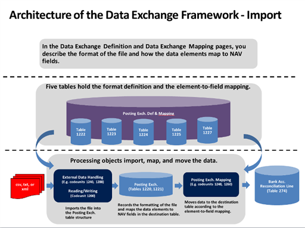

# About the Data Exchange Framework in [!INCLUDE[d365fin](includes/d365fin_md.md)]
The format of files for exchange of data in bank files, electronic documents, currency exchange rates, and other with ERP systems vary depending on the provider of the data file or stream and on the country/region. [!INCLUDE[d365fin](includes/d365fin_md.md)] supports various bank file formats and data service standards. To provide support for other electronic document formats, you use the data exchange framework. For more information, see [Exchanging Data Electronically](across-data-exchange.md).    

 The following diagrams show the architecture of the data exchange framework.  

   

   

## See Also  
[Exchanging Data Electronically](across-data-exchange.md)  
[Use XML Schemas to Prepare Data Exchange Definitions](across-how-to-use-xml-schemas-to-prepare-data-exchange-definitions.md)  
[Setting Up Data Exchange](across-set-up-data-exchange.md)  
[Exchanging Data](across-exchange-data.md)  
[Incoming Documents](across-income-documents.md)  
[General Business Functionality](ui-across-business-areas.md)  
